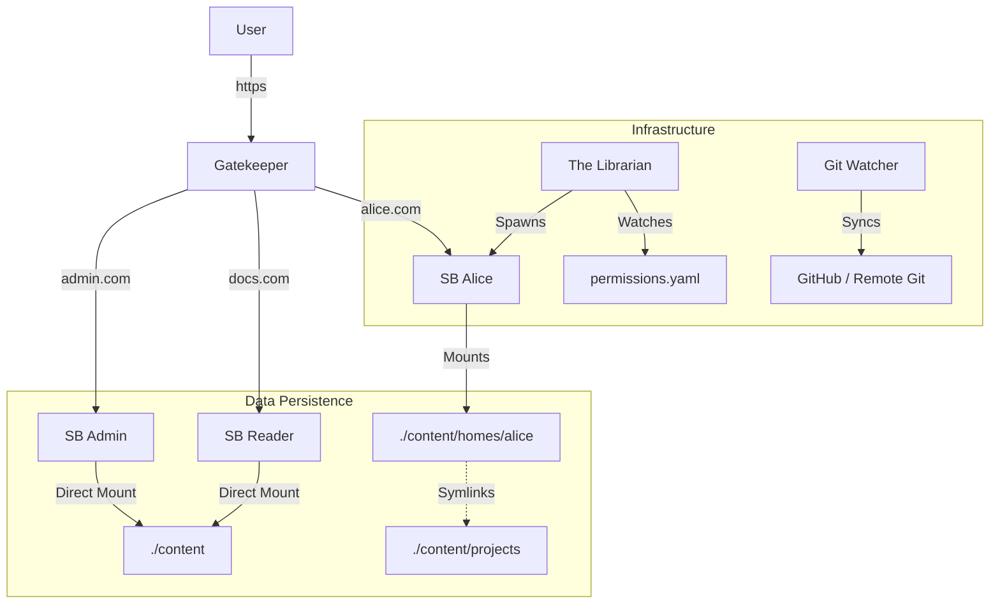

# 🧠 ng-brain

> **A self-hosted, text-first digital garden OS.**
> Powered by [SilverBullet](https://silverbullet.md), Nginx, and Docker.

**ng-brain** separates the **Engine** (infrastructure) from the **Content** (data), allowing you to upgrade or destroy the system without touching your notes. It transforms a standard SilverBullet instance into a multi-user platform with bidirectional GitHub sync, public/private access, and persistent per-user sandboxes.

## ✨ Features

* **⚡ Real-Time Bidirectional Sync:**
* **Local → Remote:** File system watchers (`inotify`) detect changes instantly and push to Git.
* **Remote → Local:** A lightweight sidecar listens for GitHub Webhooks to pull changes the moment you push from another device.


* **🏠 Persistent User Homes:** Users (Alice, Bob) get real, physical directories inside the repo (`content/homes/alice`). Their personal files persist, while shared projects are symlinked into their space.
* **🛡️ Conflict Safety:** If a sync conflict occurs, the system automatically creates a `conflict-YYYY-MM-DD` branch on the remote to save your work, then resets local to `main` to prevent lockups.
* **🤖 The Librarian:** A Go orchestrator that watches `permissions.yaml` to dynamically spin up/tear down user containers and manage symlinks in real-time.
* **🏰 The Gatekeeper:** Unified Nginx reverse proxy that handles routing for public docs (`docs.domain`), admin writer (`admin.domain`), and user subdomains (`alice.domain`).
* **⏳ Time Travel UI:** A custom Space Lua sidebar that provides commit history, instantaneous diffs, and read-only views of past file versions—all running locally.

## 🏗 Architecture

**ng-brain** follows a "Split-Brain" philosophy. The **Engine** is ephemeral; the **Content** is the source of truth.



## 🚀 Quick Start

### Prerequisites

* Docker & Docker Compose
* A domain name with wildcard DNS (`*.yourdomain.com`) pointing to your host.

### 1. Installation

```bash
git clone https://github.com/nourgaser/ng-brain.git
cd ng-brain

```

### 2. Configuration

Create a `.env` file. You **must** provide a remote Git repository (GitHub/GitLab) for the content.

```ini
# --- Identity & Domains ---
PUBLIC_HOST=docs.nourgaser.com
ADMIN_HOST=admin.nourgaser.com
SPACE_DOMAIN_SUFFIX=nourgaser.com
DEFAULT_EMAIL=bot@ng-brain.local

# --- Content Repository (Source of Truth) ---
CONTENT_REMOTE=git@github.com:you/your-notes.git
CONTENT_BRANCH=main
# Optional: Base64 encoded SSH Key (if not mounting ~/.ssh)
# CONTENT_REMOTE_SSH_KEY=...

# --- Auth ---
SB_WRITER_USER=admin
SB_WRITER_PASSWORD=change_this_immediately

# --- Infrastructure ---
HOST_ROOT_DIR=/home/user/docker/ng-brain

```

### 3. Permissions

Define users and their access levels in `content/permissions.yaml`.

```yaml
spaces:
  # Public Reader (Root Domain)
  public:
    paths:
      - "index.md"
      - "assets/"

  # Restricted User (Subdomain: alice.yourdomain.com)
  alice:
    password: "secret_password"
    paths:
      # These appear inside Alice's home directory
      - "projects/secret-game/"
      - "assets/"

```

### 4. Launch

```bash
docker compose up -d

```

## 🔌 Real-Time Sync (Webhooks)

To enable instant updates from GitHub (e.g., when you edit on mobile or VS Code), add a Webhook:

1. Go to your GitHub Repo **Settings** -> **Webhooks**.
2. **Payload URL:** `https://admin.yourdomain.com/_github_webhook`
3. **Content type:** `application/json`
4. **Events:** Just the `push` event.

The `git-watcher` service listens on an internal port and triggers a pull immediately upon receiving the signal.

## 🛠 Advanced Usage

### The Conflict Strategy

If you edit a file locally and remotely at the same time:

1. The watcher detects the conflict during the pull/rebase.
2. It takes your **Local** changes and pushes them to a new branch: `conflict-<timestamp>`.
3. It hard resets your **Local** state to match the **Remote** (Server Truth).
4. You can then merge the conflict branch manually at your leisure.

### Manual Snapshots

While the system auto-syncs on file save, you can force a snapshot via the Command Palette:

* `Cmd+K` -> **`Git: Snapshot Now`**

## 🗺 Roadmap

* [x] Bidirectional Sync (Event-driven + Webhooks)
* [x] Persistent User Homes (`content/homes/user`)
* [x] Permission Revocation (Librarian cleans up symlinks)
* [ ] Docker-in-Docker builds for custom per-user images
* [ ] CI/CD Pipeline for Engine updates
* [ ] Unified Search (across all spaces)
* [ ] Off-site Backups (S3/R2)

## 📄 License

MIT License. Built on top of [SilverBullet](https://silverbullet.md).